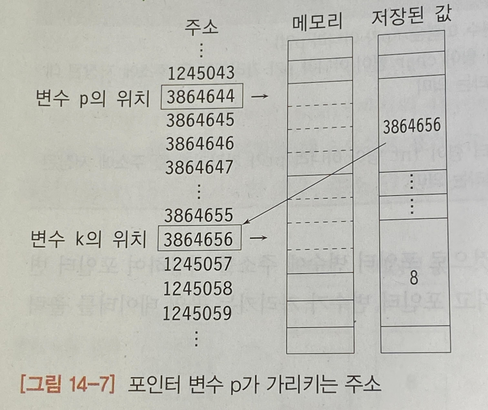
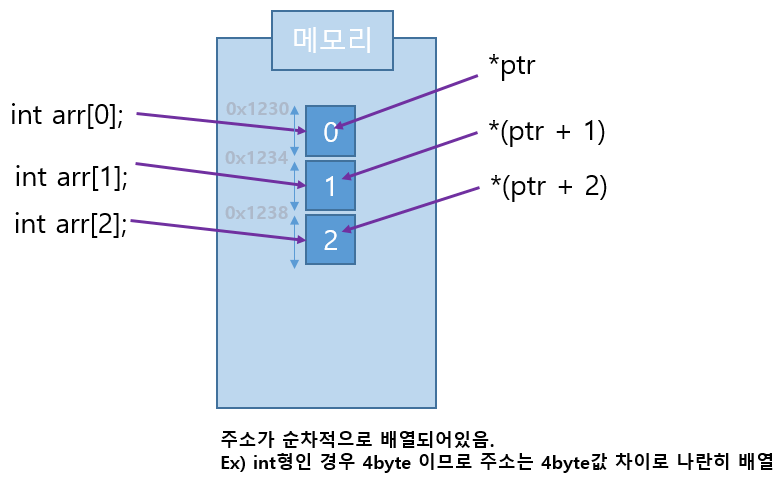

# 포인터 with 배열, 함수

생성자: 박지예 
생성 일시: 2023년 10월 19일 오후 7:58
유형: 기술 문서
태그: 스터디

---

# 포인터

**포인터** : 주소를 가리키는 존재. 변수의 주소를 저장하는 변수이다. 

메모리 주소는 4byte로 표현된 양의 정수이므로 포인터 변수 자체의 크기도 4byte이다. 

`int *p = &k;`

포인터 `p`에는 `k`의 주소가 저장된다. 즉 포인터 `p`는 `k`를 가리키게 된다. 

<p align="center">
 
</p>

| 포인터 변수 선언 | 의미 |
| --- | --- |
| char *p; | 포인터 변수 p를 선언 (변수 이름은 *p가 아니라 p임)
포인터 변수 p의 데이터 형이 char 형이 아니라 p가 가리키게 될 주소에 저장된 데이터의 형이 char 형이라는 의미 |

| 포인터 연산자 | 기능 |
| --- | --- |
| & | & 다음에 표시된 변수의 주소를 나타냄 |
| * | 간접(indirection) 연산자. 포인터가 가리키는 곳의 값을 나타냄 |

**`*`연산자와 `&`연산자**

- `*`연산자
    - `int temp = *a` 는 포인터a에 저장된 주소로 가서 그 주소에 저장된 값을 불러와(=역참조) 저장한다.
    - `*ptr = a;` ➡️ `ptr`이 가리키는 변수에 저장된 값에  `a`의 값을 집어넣겠다.
        - `ptr` : 포인터 자체를 의미
        - `*ptr` : 포인터가 가리키는 곳의 값
- `&a`는 a의 주소값을 가져온다.
    - `int *ptr = &a;` ➡️ `ptr`에 `a`의 주솟값(`&a`)를 집어넣겠다. 즉 `ptr`이 `a`를 가리키게 하겠다.

### **✨예제 : Swap 함수**

```c
void fn_swap(int *a, int *b){//포인터형 변수를 인자로 받겠다는 뜻, a의주소와 b의주소를 인자로 받는다
    // a=1, b=4라고 가정
    int temp;
    temp = *a;  //&a에 담겨 있는 값(=1)을 temp로 가져온다. 
    *a = *b;    //&a에 담겨있는 값(=1)을 &b에 담겨있는 값(=4)으로 변경
    *b = temp;  //&b에 담겨있는 값(=4)를 temp값(=1)로 변경

    //여기서 각 변수의 주소값은 변경되지 않았다. 
}
int main(){
    int a,b;
    printf("정수 두 개를 입력하세요: ");
    scanf("%d %d", &a, &b);
    printf("포인터 주소 %p %p", &a, &b);
    printf("\n");

    fn_swap(&a,&b);
    printf("바뀐 정수 : %d, %d\n", a,b);
    printf("포인터 주소 %p %p\n", &a, &b);
}
```

# 배열과 포인터

## 배열과 포인터의 관계

- **배열의 이름** : 배열의 첫 번째 요소가 저장되어 있는 주소를 가리키는 포인터 상수.
    
    ➡️ `arr` = `&arr[0]`
    
- **배열** : 번호로 구별되는 동일한 데이터 형의 연속된 기억 공간.
- **포인터에 정수를 더했을 때** :
    
    포인터를 선언할 때 자료형을 적는 이유는 가리키는 대상의 크기를 알아야 그만큼의 바이트 수를 읽어올 수 있기 때문이다. 포인터에 정숫값을 더할 때도 마찬가지로 그 대상의 크기만큼 곱해서 주솟값을 더해야 한다. 
    
    즉 포인터에 정수를 더하는 연산을 하며 포인터가 가리키는 대상의 크기만큼 곱해져서 더해진다.
    
    ➡️ 활용 - 포인터를 통해 배열에 접근 :
    
    배열은 동일한 데이터 형의 연속된 기억 공간이고, 포인터는 덧셈 연산을 했을 때 가리키는 대상의 데이터 형의 크기만큼 증가하므로 배열의 인덱스가 증가할 때와 동일한 효과를 낸다. 
    
    즉 포인터에 배열의 이름을 저장하면 포인터를 마치 배열인 것처럼 쓸 수 있다 !
    
    
    

### 포인터를 이용하여 배열을 출력하기

```c
int arr[] = {0,1,2};
int* ptr = arr;

for (int i = 0; i < 3; i++)
{
	printf("%d ", *(ptr + i));
}

//또는 ptr 자체를 for문의 매개변수로 넣는 방법
for (int *ptr_a = arr; ptr_a < arr+10; ptr_a++){
	printf("%d ", *ptr);
}
```

## 배열 가리키기 - 배열 포인터

**선언** : `int (*p_arr)[10];`  ➡️ 소괄호 필수

# 함수와 포인터

- **인수** (argument) : 함수 호출에 사용된 변수
- **인자** (매개변수, parameter) : 함수 원형이나 정의에 사용된 변수

## 함수에 인수를 넘겨주는 방법

### 값에 의한 호출 (Call by value)

이 방식은 인수가 인자에 전달될 때 변수 자체가 전달되는 것이 아니라 변수에 저장된 값만 전달된다.  

즉 함수를 호출할 때 변수에 들어있는 값이 함수에 복사되는 형태로 전달되는 것이다. 

```c
//값에 의한 호출로 만들어진 swap 함수, 함수에 전달된 a와 b의 값은 swap되지 않는다. 
void swap(int x, int y) {
	int tmp = x;
	x = y;
	y = tmp;
}
int main() {
	int a, b;
	scanf("%d%d", &a, &b);
	swap(a, b);
	printf("a=%d, b=%d\n", a, b);
}
```

### 주소에 의한 호출 (Call by address)

포인터(주소)를 함수의 인자로 사용하여 호출하는 방법. (=변수의 주솟값을 넘겨주는 방법) 이 방법을 이용하면 전달된 인수의 값을 바꿀 수 있다. 

```c
//주소에 의한 호출로 만들어진 swap함수. 이번에는 함수가 제대로 작동한다. 
void swap(int *px, int *py) {
	int tmp = *px;
	*px = *py;
	*py = tmp;
}
int main() {
	int a, b;
	scanf("%d%d", &a, &b);
	swap(&a, &b);
	printf("a=%d, b=%d\n", a, b);
}
```

### 참조에 의한 호출 (Call by reference) - C++에만 존재

함수에 전달된 인수의 값이 함수 안에서 변경된 경우, 함수를 호출한 쪽에도 영향을 미치는 것. 그러나 주솟값을 사용하지 않는다. (래퍼런스 변수 사용, 변수에 별명을 붙이는 것)

```cpp
void swap(int &x, int &y) {
	int tmp = x;
	x = y;
	y = tmp;
}
int main() {
	int a, b;
	scanf("%d%d", &a, &b);
	swap(a, b);
	printf("a=%d, b=%d\n", a, b);
}
```

|  | Call by value | Call by address | Call by reference |
| --- | --- | --- | --- |
| 지원하는 언어 | C, C++ | C, C++ | C++ |
| 매개변수의 자료형 | int | int * | int & |
| 넘겨주는 인수 | 원본 변수의 값 | 원본 변수의 주솟값 | 원본 변수의 이름 |
| 복사되는 값 | 원본 변수의 값 | 원본 변수의 주솟값 | x |

---

# 참고자료

[[C언어] C언어 배열을 포인터로 변환하기 (배열을 포인터로 바꾸기)](https://ansan-survivor.tistory.com/1250)

- 두들낙서의 C/C++ 한꺼번에 배우기 - 위키북스
- 명품 C언어 프로그래밍 - 생능출판사