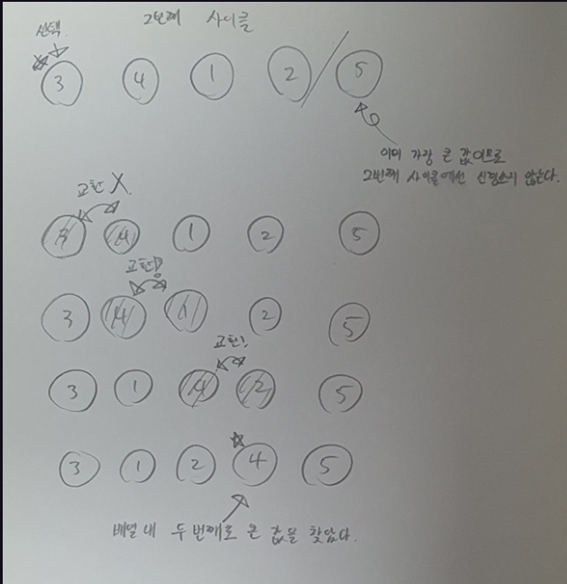
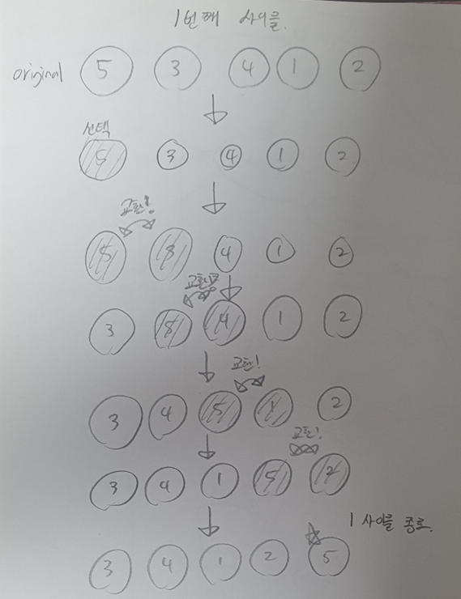
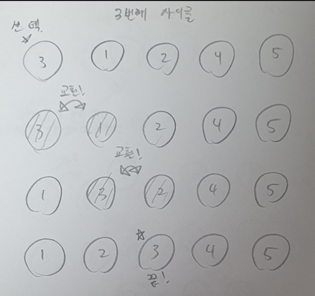
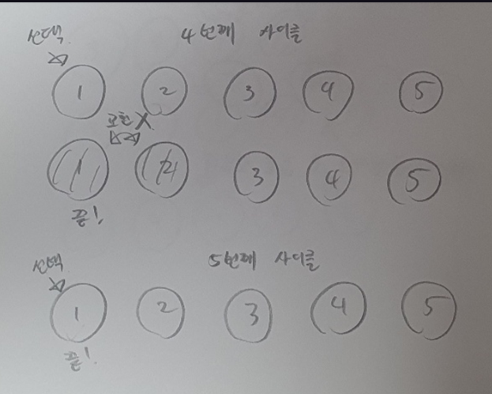

`버블 정렬(Bubble Sort)` 은 정렬 알고리즘의 일종이다. $O(N^2)$ 의 시간복잡도를 가진다.

## 이해

`버블 정렬` 은 `배열` 의 맨 뒷자리부터 해당 자리에 어떤 숫자가 와야 하는지 결정하는 알고리즘이라고 이해하면 된다. 값이 결정됐다면 해당 자리에 그 숫자가 가도록 배열의 이웃하는 값들을 `교환`한다.
예를 들어 `{5, 3, 2, 1, 4}` 와 같은 배열을 버블 정렬을 통해 오름차순 정렬한다고 하면, 맨 마지막 자리인 `4` 가 있는 자리에는 `5` 가 있어야 한다. 즉 지금 `첫 번째` 자리에 있는 `5` 를 `4번` 교환해서 `{3, 2, 1, 4, 5}`  로 만들어주는 것이다. 이 때, 맨 마지막 자리에는 `5` 가 들어갔고, 이는 맨 마지막 자리에 올바른 수가 들어갔음을 보장하므로 다음엔 `네 번째` 자리에 들어갈 값에 대한 `교환` 을 반복한다.
더 쉽게 생각해보자면 다음과 같이 생각할 수 있다.
1. `{5, 3, 2, 1, 4}` 에서 최대 값을 맨 마지막으로 보낸다(오름차순 이므로)
2. `{3, 2, 1, 4}` 에서 최대 값을 맨 마지막으로 보내도록 교환한다.
3. `{3, 2, 1}` 에서 최대 값을 맨 마지막으로 보내도록 교환한다.
4. ... 반복

즉 한 `사이클` 마다 `부분 배열` 의 크기를 하나씩 줄여가면서 각 `부분 배열` 의 최대 값을 맨 오른쪽으로 보내도록 교환하는 알고리즘이다.

최악의 경우 `{5, 4, 3, 2, 1}` 일 때 `{1, 2, 3, 4, 5}` 로 만들기 위해 $4 + 3+ 2+ 1$ 번의 교환이 일어나야 하기 때문에 이는 $= O(\frac{(N) \times (N-1)}{2})=O(N^2)$ 의 `시간복잡도`를 가진다.

## 그림






`{5, 3, 4, 1, 2}` 배열을 오름차순으로 버블 정렬하는 사이클을 그려봤다. 결국 `N` 번째 사이클에선 배열에서 `N` 번째로 큰 값을 배열들의 값을 교환해가며 `배열 크기 - N + 1`  의 위치에 놓는 것이다.

## 코드

`새싹 스터디` 중에 공부 한 내용이므로 `C언어` 로 구현했다.

```c
#include <unistd.h>
#include <stdio.h>

void swap(int *left, int *right)
{
    int temp = *left;
    *left = *right;
    *right = temp;
}

// 버블 소트
void fn_sort(int *arr, int length)
{
    for (int i = 0; i < length; i++)
    {
        for (int j = 0; j < length - i - 1; j++)
        {
            int *left = (arr + j);
            int *right = (arr + j + 1);

            if (*right < *left)
            {
                swap(left, right);
            }
        }
    }
}

int main()
{
    int array[] = {5, 10, 7, 2, 4};
    int length = sizeof(array) / sizeof(int);
    fn_sort(array, length);

    for (int i = 0; i < length; i++)
    {
        printf("%d ", array[i]);
    }
    printf("\n");
}
```